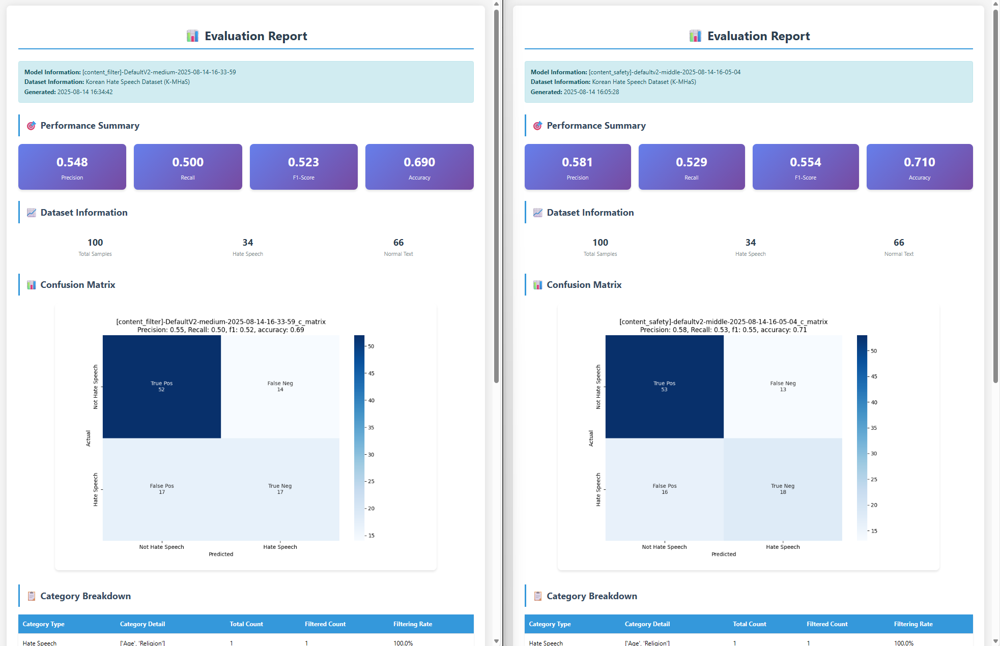

# Content Filter evaluation tool using Korean hate-speech dataset

## Overview

Azure OpenAI Service includes a content filtering system that works alongside LLM, including image generation models. This system works by running both the prompt and completion through an ensemble of classification models designed to detect and prevent the output of harmful content. This tool evaluates two different content safety approaches:

1. **Content Filter**: Azure OpenAI's built-in content filtering system
2. **Content Safety**: Azure Content Safety service for dedicated content analysis

The content filtering models for the hate, sexual, violence, and self-harm categories support English, German, Japanese, Spanish, French, Italian, Portuguese, and Chinese. The service can work in many other languages however, the quality may vary which means that testing is essential especially for non-supported language such as Korean. In addition, even if you set up the content filter for a supported language, you need to test it to ensure that your filter detects the content at the severity levels you set up for prompts and completions. This tool performs benchmarking on hate-speech dataset with minimal time and effort, allowing you to understand the current performance of your established content filter, what types of content have been filtered, and to configure appropriate levels of your content filter.

## Features

- **Multi-processing support**: Parallel execution for faster processing
- **Batch processing**: Configurable batch sizes for optimal performance
- **Multiple evaluation targets**: 
  - `content_filter`: Azure OpenAI Content Filter evaluation
  - `content_safety`: Azure Content Safety service evaluation
- **Multiple model configurations**: Support for different deployment configurations
- **Environment-based configuration**: Support for multiple `.env` files for different deployments

---

## Blocking Threshold in Content Filter VS Severity Level in Content Safety

> ⚠ **Important:**  
> The meaning of "higher" and "lower" levels is **opposite** between Content Filter's **Blocking Threshold** and Content Safety's **Severity Level**.
> 
> - **Content Filter (Blocking Threshold)**: Higher → blocks **more** content.  
> - **Content Safety (Severity Level)**: Lower → detects **more** harmful content.


### 📌 Easy Explanation
- **Content Filter**: **Low → blocks less**, **High → blocks more**  
- **Content Safety**: **Low (1–2) → highly sensitive**, **High (5–6) → only catches the most severe**  
- In other words, **"Low"** in Content Filter ≠ **"Low"** in Content Safety. They mean the opposite.


### 🔍 Comparison Table

| Content Filter<br>(Blocking Threshold) | Content Safety<br>(Severity Level) | Description |
|----------------------------------------|--------------------------------------|-------------|
| Low                                    | High (5–6)                                  | Content Filter: Blocks mild cases only.<br>Content Safety: Catches only the most severe harmful content. |
| Medium                                 | Medium (3–4)                                  | Content Filter: Balanced blocking.<br>Content Safety: Catches moderate harmful content. |
| High                                   | Low (1–2)                                  | Content Filter: Blocks almost everything suspicious.<br>Content Safety: Detects even mild or borderline harmful content. |

### 🎯 Visual Level Diagram
<pre>
Content Filter (Blocking Threshold) <br>
Low ──▢▢──────────── High <br>
Less Blocking       More Blocking
</pre>

<pre>
Content Safety (Severity Level) <br>
Low ──■■──────────── High <br>
More Sensitive      Less Sensitive
</pre>

**Legend:**  
- **▢▢** = Blocking intensity in Content Filter  
- **■■** = Detection sensitivity in Content Safety  


### 💡 Quick Memory Tip
- **Content Filter**: *Low → blocks less*  
- **Content Safety**: *Low → detects more*

---

## Usage

### Prerequisites

1. Install dependencies:
```bash
pip install -r requirements.txt
```

2. Configure environment files using .env.sample:
   - `.env_gpt-4-nano-low`: Configuration for low filtering threshold
   - `.env_gpt-4-nano-high`: Configuration for high filtering threshold

### Command Line Arguments

```bash
python main.py [OPTIONS]

Options:
  --num_samples INT          Number of samples to process (default: 2000)
  --is_random BOOL          Whether to randomize samples (default: False) 
  --is_debug BOOL           Debug mode (default: False)
  --num_debug_samples INT   Number of debug samples (default: 15)
  --model_provider STR      Model provider (default: azureopenai)
  --hf_model_id STR         Hugging Face model ID (default: gpt-4-nano)
  --max_retries INT         Maximum retry attempts (default: 3)
  --max_tokens INT          Maximum tokens (default: 256)
  --temperature FLOAT       Temperature (default: 0)
  --batch_size INT          Batch size (default: 10)
  --evaluation_target STR   Evaluation target: content_filter or content_safety
  --use_multiprocessing BOOL Enable multiprocessing (default: True)
  --max_workers INT         Maximum worker processes (default: 3)
  --locale STR              Output language (default: ko-KR)
```


### Tunable parameters
```python
    parser.add_argument("--num_samples", type=int, default=2000)
    parser.add_argument("--is_random", type=str2bool, default=False)
    parser.add_argument("--is_debug", type=str2bool, default=True)
    parser.add_argument("--num_debug_samples", type=int, default=30)
    parser.add_argument("--model_provider", type=str, default="azureopenai")
    parser.add_argument("--split", type=str, default="valid")
    parser.add_argument("--max_retries", type=int, default=3)
    parser.add_argument("--max_tokens", type=int, default=256)
    parser.add_argument("--temperature", type=float, default=0)
    parser.add_argument("--batch_size", type=int, default=5)
    parser.add_argument("--evaluation_target", type=str, default="content_filter", 
                       choices=["content_filter", "content_safety"],
                       help="Target evaluation: content_filter (Azure OpenAI Content Filter) or content_safety (Azure Content Safety)")
    
    parser.add_argument("--use_multiprocessing", type=str2bool, default=True, help="Enable multiprocessing")
    parser.add_argument("--max_workers", type=int, default=3, help="Maximum number of worker processes")
    
    parser.add_argument("--locale", type=str, default="ko-KR", 
                       choices=["ko-KR", "en-US"],
                       help="Output language: ko-KR (Korean) or en-US (English)")
```


### Running Evaluations

#### Single Evaluation
```bash
# Content Filter evaluation
DOTENV_PATH=.env_gpt-4-nano-low python main.py --evaluation_target content_filter

# Content Safety evaluation  
DOTENV_PATH=.env_gpt-4-nano-low python main.py --evaluation_target content_safety
```

#### Batch Evaluation
```bash
# Run all evaluations for multiple models and evaluation targets
./run_all_env.sh
```

### Environment Configuration

#### For Azure OpenAI Content Filter 
```bash
AZURE_OPENAI_ENDPOINT=https://your-resource-name.openai.azure.com/
AZURE_OPENAI_API_KEY=your-api-key-here
AZURE_OPENAI_DEPLOYMENT_NAME=gpt-4-nano-low
AZURE_OPENAI_API_VERSION=2024-02-15-preview
FILTER_NAME=defaultv2
BLOCKING_THRESHOLD_LEVEL=middle
```

#### For Azure Content Safety
```bash
CONTENT_SAFETY_ENDPOINT=https://your-content-safety-resource.cognitiveservices.azure.com/
CONTENT_SAFETY_KEY=your-content-safety-key-here
# Higher levels focus only on the most severe harmful content, while lower levels also detect milder or borderline cases.
# 1-2: low
# 3-4: medium
# 5-6: high
CONTENT_SAFETY_THRESHOLD=4
```

---

## Korean Hate Speech Detection Evaluation Report

### Evaluation Overview 

- **Dataset**: K-MHaS (Korean Multi-label Hate Speech Dataset) 2000 samples from valid split
- **Evaluation Target**: Azure OpenAI Content Filter vs Azure Content Safety
- **Metrics**: Precision, Recall, F1-Score, Accuracy
- **Created**: 2025-08-14

### Performance Comparison: Content Filter vs Content Safety

| Method | Blocking/Severity | Precision | Recall | F1-Score | Accuracy | False Positive Rate | False Negative Rate |
|--------|-----------|-----------|--------|----------|----------|--------------------|--------------------|
| **Content Filter** | Low | 0.771 | 0.043 | 0.081 | 0.578 | 0.010 | 0.957 |
| **Content Filter** | Medium | 0.679 | 0.491 | 0.570 | 0.677 | 0.179 | 0.509 |
| **Content Filter** | High | 0.568 | 0.878 | 0.690 | 0.657 | 0.513 | 0.122 |
| **Content Safety** | 1~2 | 0.545 | 0.905 | 0.681 | 0.630 | 0.581 | 0.095 |
| **Content Safety** | 3~4 | 0.675 | 0.522 | 0.588 | 0.682 | 0.194 | 0.478 |
| **Content Safety** | 5~6 | 0.782 | 0.049 | 0.093 | 0.581 | 0.011 | 0.951 |

### Content Filter Evaluation Results

#### Overall Performance Metrics

| Blocking threshold | Precision | Recall | F1-Score | Accuracy | TP | TN | FP | FN | Total |
|-----------|-----------|--------|----------|----------|----|----|----|----|-------|
| **Low** | 0.771 | 0.043 | 0.081 | 0.578 | 37 | 1119 | 11 | 833 | 2000 |
| **Medium** | 0.679 | 0.491 | 0.570 | 0.677 | 427 | 928 | 202 | 443 | 2000 |
| **High** | 0.568 | 0.878 | 0.690 | 0.657 | 764 | 550 | 580 | 106 | 2000 |

#### Detailed Category Analysis

|         |                                   |low||medium||high||
|---------------|-----------------------------------------|-------------|------|--------|------|--------------|------|
|category_big   |category                                 |filtered<br>count        |filtered<br>mean  |filtered<br>count   |filtered<br>mean  |filtered<br>count         |filtered<br>mean  |
|Hate Speech    |['Age', 'Gender', 'Religion']            |0            |0.000 |2       |1.000 |2             |1.000 |
|Hate Speech    |['Age', 'Gender']            |1            |0.111 |7       |0.778 |9             |1.000 |
|Hate Speech    |['Age', 'Profanity']            |0            |0.000 |0       |0.000 |2             |1.000 |
|Hate Speech    |['Age', 'Religion', 'Race']            |0            |0.000 |1       |1.000 |1             |1.000 |
|Hate Speech    |['Age', 'Religion']            |1            |0.062 |9       |0.562 |15             |0.938 |
|Hate Speech    |['Age']            |3            |0.018 |54       |0.320 |138             |0.817 |
|Hate Speech    |['Gender', 'Religion']            |0            |0.000 |8       |0.364 |20             |0.909 |
|Hate Speech    |['Gender']            |3            |0.042 |34       |0.472 |56             |0.778 |
|Hate Speech    |['Origin', 'Age', 'Religion']            |0            |0.000 |3       |0.750 |3             |0.750 |
|Hate Speech    |['Origin', 'Age']            |1            |0.032 |23       |0.742 |30             |0.968 |
|Hate Speech    |['Origin', 'Gender']            |0            |0.000 |0       |0.000 |1             |1.000 |
|Hate Speech    |['Origin', 'Physical', 'Age']            |0            |0.000 |3       |0.600 |5             |1.000 |
|Hate Speech    |['Origin', 'Physical']            |0            |0.000 |2       |0.667 |3             |1.000 |
|Hate Speech    |['Origin', 'Religion']            |1            |0.056 |9       |0.500 |15             |0.833 |
|Hate Speech    |['Origin']            |0            |0.000 |50       |0.510 |84             |0.857 |
|Hate Speech    |['Physical', 'Age', 'Gender']            |0            |0.000 |1       |1.000 |1             |1.000 |
|Hate Speech    |['Physical', 'Age', 'Race']            |0            |0.000 |1       |1.000 |1             |1.000 |
|Hate Speech    |['Physical', 'Age']            |1            |0.056 |12       |0.667 |17             |0.944 |
|Hate Speech    |['Physical', 'Gender']            |1            |0.067 |8       |0.533 |14             |0.933 |
|Hate Speech    |['Physical', 'Religion']            |1            |0.250 |3       |0.750 |4             |1.000 |
|Hate Speech    |['Physical']            |6            |0.053 |35       |0.310 |95             |0.841 |
|Hate Speech    |['Politics', 'Age', 'Gender']            |0            |0.000 |2       |1.000 |2             |1.000 |
|Hate Speech    |['Politics', 'Age', 'Religion']            |1            |0.333 |1       |0.333 |3             |1.000 |
|Hate Speech    |['Politics', 'Age']            |1            |0.050 |13       |0.650 |18             |0.900 |
|Hate Speech    |['Politics', 'Gender']            |0            |0.000 |1       |1.000 |1             |1.000 |
|Hate Speech    |['Politics', 'Origin', 'Age', 'Religion']            |0            |0.000 |1       |1.000 |1             |1.000 |
|Hate Speech    |['Politics', 'Origin', 'Age']            |0            |0.000 |0       |0.000 |1             |0.500 |
|Hate Speech    |['Politics', 'Origin', 'Physical']            |1            |1.000 |1       |1.000 |1             |1.000 |
|Hate Speech    |['Politics', 'Origin', 'Religion']            |0            |0.000 |1       |0.500 |2             |1.000 |
|Hate Speech    |['Politics', 'Origin']            |0            |0.000 |1       |1.000 |1             |1.000 |
|Hate Speech    |['Politics', 'Physical', 'Age']            |0            |0.000 |4       |0.800 |4             |0.800 |
|Hate Speech    |['Politics', 'Physical']            |1            |0.062 |13       |0.812 |16             |1.000 |
|Hate Speech    |['Politics', 'Religion']            |0            |0.000 |10       |0.667 |15             |1.000 |
|Hate Speech    |['Politics']            |10            |0.098 |70       |0.686 |98             |0.961 |
|Hate Speech    |['Profanity']            |2            |0.067 |14       |0.467 |26             |0.867 |
|Hate Speech    |['Race']            |0            |0.000 |1       |1.000 |1             |1.000 |
|Hate Speech    |['Religion', 'Race']            |0            |0.000 |1       |1.000 |1             |1.000 |
|Hate Speech    |['Religion']            |2            |0.032 |28       |0.452 |57             |0.919 |
|Not Hate Speech    |['Not Hate Speech']            |11            |0.010 |202       |0.179 |580             |0.513 |
|**Filtering Total**|                                         |             |      |        |      |              |      |
|**Hate Speech**    |-                                        |**37**          |**0.043** |**427**      |**0.491** |**764**            |**0.878** |
|**Not Hate Speech**|-                                        |**11**          |**0.010** |**202**      |**0.179** |**580**             |**0.513** |

### Content Safety Evaluation Results

#### Overall Performance Metrics

| Severity level | Precision | Recall | F1-Score | Accuracy | TP | TN | FP | FN | Total |
|-----------|-----------|--------|----------|----------|----|----|----|----|-------|
| **Low (1~2)** | 0.545 | 0.905 | 0.681 | 0.630 | 787 | 474 | 656 | 83 | 2000 |
| **Medium (3~4)** | 0.675 | 0.522 | 0.588 | 0.682 | 454 | 911 | 219 | 416 | 2000 |
| **High (5~6)** | 0.782 | 0.049 | 0.093 | 0.581 | 43 | 1118 | 12 | 827 | 2000 |

#### Detailed Category Analysis

|         |                                   |low<br>(1~2)||medium<br>(3~4)||high<br>(5~6)||
|---------------|-----------------------------------------|-------------|------|--------|------|--------------|------|
|category_big   |category                                 |filtered<br>count        |filtered<br>mean  |filtered<br>count   |filtered<br>mean  |filtered<br>count         |filtered<br>mean  |
|Hate Speech    |['Age', 'Gender', 'Religion']            |2            |1.000 |1       |0.500 |0             |0.000 |
|Hate Speech    |['Age', 'Gender']            |9            |1.000 |8       |0.889 |0             |0.000 |
|Hate Speech    |['Age', 'Profanity']            |2            |1.000 |2       |1.000 |0             |0.000 |
|Hate Speech    |['Age', 'Religion', 'Race']            |1            |1.000 |1       |1.000 |0             |0.000 |
|Hate Speech    |['Age', 'Religion']            |16            |1.000 |7       |0.438 |0             |0.000 |
|Hate Speech    |['Age']            |150            |0.888 |77       |0.456 |4             |0.024 |
|Hate Speech    |['Gender', 'Religion']            |20            |0.909 |10       |0.455 |1             |0.045 |
|Hate Speech    |['Gender']            |60            |0.833 |28       |0.389 |3             |0.042 |
|Hate Speech    |['Origin', 'Age', 'Religion']            |4            |1.000 |2       |0.500 |0             |0.000 |
|Hate Speech    |['Origin', 'Age']            |30            |0.968 |24       |0.774 |1             |0.032 |
|Hate Speech    |['Origin', 'Gender']            |0            |0.000 |0       |0.000 |0             |0.000 |
|Hate Speech    |['Origin', 'Physical', 'Age']            |5            |1.000 |5       |1.000 |0             |0.000 |
|Hate Speech    |['Origin', 'Physical']            |3            |1.000 |3       |1.000 |0             |0.000 |
|Hate Speech    |['Origin', 'Religion']            |17            |0.944 |9       |0.500 |1             |0.056 |
|Hate Speech    |['Origin']            |81            |0.827 |44       |0.449 |1             |0.010 |
|Hate Speech    |['Physical', 'Age', 'Gender']            |1            |1.000 |1       |1.000 |0             |0.000 |
|Hate Speech    |['Physical', 'Age', 'Race']            |1            |1.000 |1       |1.000 |0             |0.000 |
|Hate Speech    |['Physical', 'Age']            |18            |1.000 |13       |0.722 |1             |0.056 |
|Hate Speech    |['Physical', 'Gender']            |14            |0.933 |7       |0.467 |0             |0.000 |
|Hate Speech    |['Physical', 'Religion']            |4            |1.000 |3       |0.750 |1             |0.250 |
|Hate Speech    |['Physical']            |98            |0.867 |55       |0.487 |8             |0.071 |
|Hate Speech    |['Politics', 'Age', 'Gender']            |2            |1.000 |1       |0.500 |0             |0.000 |
|Hate Speech    |['Politics', 'Age', 'Religion']            |3            |1.000 |1       |0.333 |1             |0.333 |
|Hate Speech    |['Politics', 'Age']            |19            |0.950 |14       |0.700 |1             |0.050 |
|Hate Speech    |['Politics', 'Gender']            |1            |1.000 |1       |1.000 |0             |0.000 |
|Hate Speech    |['Politics', 'Origin', 'Age', 'Religion']            |1            |1.000 |1       |1.000 |0             |0.000 |
|Hate Speech    |['Politics', 'Origin', 'Age']            |1            |0.500 |1       |0.500 |0             |0.000 |
|Hate Speech    |['Politics', 'Origin', 'Physical']            |1            |1.000 |1       |1.000 |1             |1.000 |
|Hate Speech    |['Politics', 'Origin', 'Religion']            |2            |1.000 |0       |0.000 |0             |0.000 |
|Hate Speech    |['Politics', 'Origin']            |1            |1.000 |1       |1.000 |0             |0.000 |
|Hate Speech    |['Politics', 'Physical', 'Age']            |5            |1.000 |4       |0.800 |0             |0.000 |
|Hate Speech    |['Politics', 'Physical']            |15            |0.938 |10       |0.625 |0             |0.000 |
|Hate Speech    |['Politics', 'Religion']            |15            |1.000 |9       |0.600 |0             |0.000 |
|Hate Speech    |['Politics']            |97            |0.951 |70       |0.686 |13             |0.127 |
|Hate Speech    |['Profanity']            |28            |0.933 |16       |0.533 |4             |0.133 |
|Hate Speech    |['Race']            |1            |1.000 |0       |0.000 |0             |0.000 |
|Hate Speech    |['Religion', 'Race']            |1            |1.000 |1       |1.000 |1             |1.000 |
|Hate Speech    |['Religion']            |58            |0.935 |22       |0.355 |1             |0.016 |
|Not Hate Speech    |['Not Hate Speech']            |656            |0.581 |219       |0.194 |12             |0.011 |
|**Filtering Total**|                                         |             |      |        |      |              |      |
|**Hate Speech**    |-                                        |**787**          |**0.905** |**454**      |**0.522** |**43**            |**0.049** |
|**Not Hate Speech**|-                                        |**656**          |**0.581** |**219**      |**0.194** |**12**             |**0.011** |
### Evaluation Report Comparison


### Accessible data files
- [evaluated result data](results/[content_filter]-DefaultV2-medium-2025-08-14-16-33-59.csv)
- [evaluated confusion matrix](results/[content_filter]-DefaultV2-medium-2025-08-14-16-33-59_c_matrix.png)
- [evaluation report](results/[content_filter]-DefaultV2-medium-2025-08-14-16-33-59_en_report.html)

### 🏆 Performance Review
- Most Practical Default Setting
We recommend starting with ACS(Azure Content Safety) Medium (3–4). It is similar to or slightly better than CF(Content Filter) Medium, with accuracy of 0.71 vs. 0.69 and lower false positives (FPR 0.197 vs. 0.212), providing a good balance between catching harmful content and avoiding over-blocking.

- Maximum Blocking 
CF(Content Filter) High or ACS(Azure Content Safety) Low (1–2) achieve higher recall but have very high false positive rates (CF High FPR: 0.606, ACS 1–2 FPR: 0.682). 

- Minimum Blocking 
CF(Content Filter) Low or ACS(Azure Content Safety) High (5–6) achieve the lowest block rate — very low FPR but extremely high FNR (i.e., high precision, very low recall). In this sample evaluation showed FPR ≈ 0.015 and FNR ≈ 0.97, meaning most harmful content slips through while safe messages are almost never blocked.

- Caution
Korean is not an officially supported language, so model performance may vary. This report is based on a small sample size (100), meaning decisions should be made under a “multi-layer defense + continuous tuning” approach rather than relying solely on a single static configuration.

---

### The Korean Multi-label Hate Speech Dataset, K-MHaS 
The Korean Multi-label Hate Speech Dataset, K-MHaS, consists of 109,692 utterances from Korean online news comments, labelled with 8 fine-grained hate speech classes (labels: Politics, Origin, Physical, Age, Gender, Religion, Race, Profanity) or Not Hate Speech class. Each utterance provides from a single to four labels that can handles Korean language patterns effectively. For more details, please refer to our paper about K-MHaS, published at COLING 2022. 

- [Paper](https://aclanthology.org/2022.coling-1.311/), [Hugging Face](https://huggingface.co/datasets/nayohan/K-MHaS)


## References

[K-MHaS: A Multi-label Hate Speech Detection Dataset in Korean Online News Comment](https://aclanthology.org/2022.coling-1.311) (Lee et al., COLING 2022)
