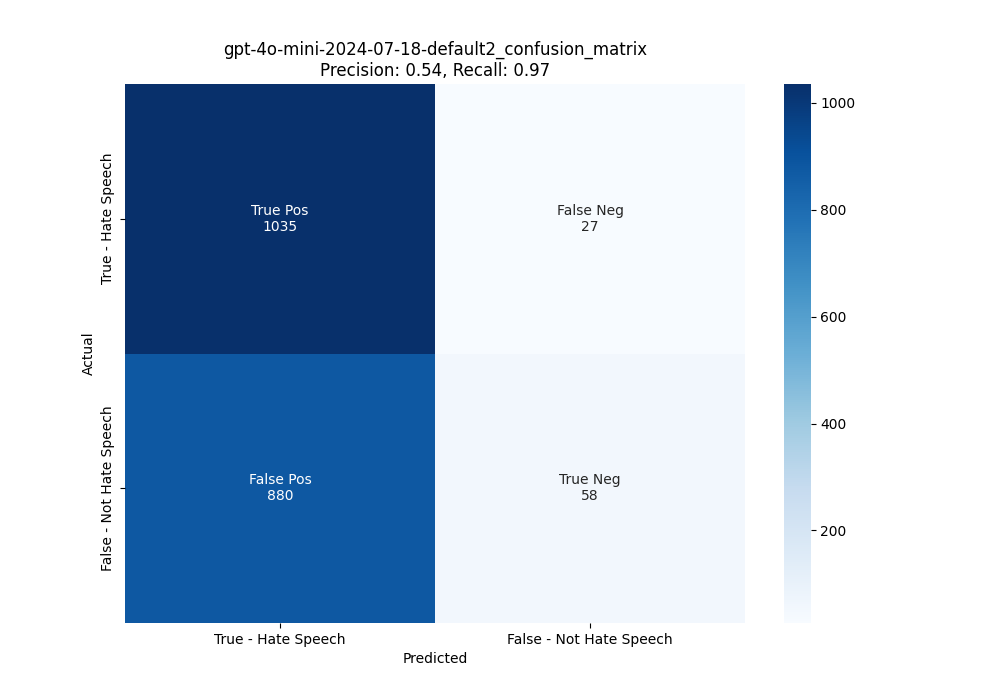

# Content Filter evaluation tool using By Korean hate-speech dataset

## Overview

Azure OpenAI Service includes a content filtering system that works alongside LLM, including image generation models. This system works by running both the prompt and completion through an ensemble of classification models designed to detect and prevent the output of harmful content.  The content filtering models for the hate, sexual, violence, and self-harm categories support English, German, Japanese, Spanish, French, Italian, Portuguese, and Chinese. The service can work in many other languages however, the quality may vary which means that testing is essential especially for non-supported language such as Korean. In addition, even if you set up the content filter for a supported language, you need to test it to ensure that your filter detects the content at the severity levels you set up for prompts and completions. This tool performs benchmarking on hate-speech dataset with minimal time and effort, allowing you to understand the current performance of your established content filter, what types of content have been filtered, and to configure appropriate levels of your content filter.  


### The Korean Multi-label Hate Speech Dataset, K-MHaS
The Korean Multi-label Hate Speech Dataset, K-MHaS, consists of 109,692 utterances from Korean online news comments, labelled with 8 fine-grained hate speech classes (labels: Politics, Origin, Physical, Age, Gender, Religion, Race, Profanity) or Not Hate Speech class. Each utterance provides from a single to four labels that can handles Korean language patterns effectively. For more details, please refer to our paper about K-MHaS, published at COLING 2022. 

- [Paper](https://aclanthology.org/2022.coling-1.311/), [Hugging Face](https://huggingface.co/datasets/jeanlee/kmhas_korean_hate_speech)

## Implementation

The code is reused https://github.com/daekeun-ml/evaluate-llm-on-korean-dataset, but a lot of parts have changed to evaluate the performance of various content filtering scenarios such as An inappropriate input prompt(ResponsibleAIPolicyViolation), won't return any content when the content is filtered (prompt content filter and completion_filter).

## Test results (using 2000 sample data)

### GPT-4o
|         |                                  |low threshold<br>(custom filter) |      |default2      |       |high threshold<br>(custom filter)|       |
|---------------|-----------------------------------------|--------------|-------------|--------------|-------------|--------------|-------------|
|category_big   |category                                 |filtered<br>count         |filtered<br>mean         |filtered<br>count         |filtered<br>mean         |filtered<br>count         |filtered<br>mean         |
|Hate Speech    |['Age', 'Gender', 'Religion']            |3             |1.000        |0             |0.000        |0             |0.000        |
|Hate Speech    |['Age', 'Gender']                        |3             |0.375        |1             |0.125        |0             |0.000        |
|Hate Speech    |['Age', 'Profanity']                     |2             |0.400        |0             |0.000        |0             |0.000        |
|Hate Speech    |['Age', 'Race']                          |2             |1.000        |1             |0.500        |0             |0.000        |
|Hate Speech    |['Age', 'Religion']                      |10            |0.625        |0             |0.000        |1             |0.063        |
|Hate Speech    |['Age']                                  |51            |0.288        |6             |0.034        |0             |0.000        |
|Hate Speech    |['Gender', 'Religion']                   |4             |0.444        |0             |0.000        |0             |0.000        |
|Hate Speech    |['Gender']                               |23            |0.284        |3             |0.037        |1             |0.012        |
|Hate Speech    |['Origin', 'Age', 'Religion']            |0             |0.000        |0             |0.000        |0             |0.000        |
|Hate Speech    |['Origin', 'Age']                        |13            |0.591        |2             |0.091        |0             |0.000        |
|Hate Speech    |['Origin', 'Gender']                     |0             |0.000        |0             |0.000        |0             |0.000        |
|Hate Speech    |['Origin', 'Physical', 'Age']            |1             |0.500        |0             |0.000        |0             |0.000        |
|Hate Speech    |['Origin', 'Physical']                   |1             |0.200        |0             |0.000        |1             |0.200        |
|Hate Speech    |['Origin', 'Religion']                   |6             |0.333        |1             |0.056        |0             |0.000        |
|Hate Speech    |['Origin']                               |29            |0.326        |5             |0.056        |0             |0.000        |
|Hate Speech    |['Physical', 'Age', 'Gender']            |1             |0.333        |0             |0.000        |0             |0.000        |
|Hate Speech    |['Physical', 'Age']                      |13            |0.481        |2             |0.074        |1             |0.037        |
|Hate Speech    |['Physical', 'Gender', 'Profanity']      |0             |0.000        |0             |0.000        |0             |0.000        |
|Hate Speech    |['Physical', 'Gender', 'Religion']       |0             |0.000        |0             |0.000        |0             |0.000        |
|Hate Speech    |['Physical', 'Gender']                   |9             |0.375        |0             |0.000        |0             |0.000        |
|Hate Speech    |['Physical', 'Profanity']                |1             |0.250        |0             |0.000        |0             |0.000        |
|Hate Speech    |['Physical', 'Religion']                 |1             |0.250        |0             |0.000        |0             |0.000        |
|Hate Speech    |['Physical']                             |41            |0.333        |2             |0.016        |0             |0.000        |
|Hate Speech    |['Politics', 'Age', 'Gender']            |1             |0.500        |0             |0.000        |0             |0.000        |
|Hate Speech    |['Politics', 'Age', 'Religion']          |3             |1.000        |0             |0.000        |0             |0.000        |
|Hate Speech    |['Politics', 'Age']                      |15            |0.600        |1             |0.040        |1             |0.040        |
|Hate Speech    |['Politics', 'Gender', 'Religion']       |0             |0.000        |0             |0.000        |0             |0.000        |
|Hate Speech    |['Politics', 'Gender']                   |1             |0.500        |0             |0.000        |0             |0.000        |
|Hate Speech    |['Politics', 'Origin', 'Age', 'Religion']|1             |1.000        |0             |0.000        |0             |0.000        |
|Hate Speech    |['Politics', 'Origin', 'Age']            |1             |1.000        |0             |0.000        |0             |0.000        |
|Hate Speech    |['Politics', 'Origin', 'Religion']       |1             |0.500        |0             |0.000        |0             |0.000        |
|Hate Speech    |['Politics', 'Origin']                   |1             |1.000        |0             |0.000        |0             |0.000        |
|Hate Speech    |['Politics', 'Physical', 'Age']          |1             |0.250        |0             |0.000        |0             |0.000        |
|Hate Speech    |['Politics', 'Physical', 'Religion']     |1             |1.000        |0             |0.000        |0             |0.000        |
|Hate Speech    |['Politics', 'Physical']                 |15            |0.682        |1             |0.045        |0             |0.000        |
|Hate Speech    |['Politics', 'Profanity']                |1             |0.500        |0             |0.000        |0             |0.000        |
|Hate Speech    |['Politics', 'Religion']                 |11            |0.550        |0             |0.000        |0             |0.000        |
|Hate Speech    |['Politics']                             |76            |0.598        |11            |0.087        |2             |0.016        |
|Hate Speech    |['Profanity']                            |20            |0.541        |2             |0.054        |0             |0.000        |
|Hate Speech    |['Race']                                 |2             |0.500        |1             |0.250        |0             |0.000        |
|Hate Speech    |['Religion', 'Race']                     |0             |0.000        |0             |0.000        |0             |0.000        |
|Hate Speech    |['Religion']                             |25            |0.446        |1             |0.018        |0             |0.000        |
|Not Hate Speech|['Not Hate Speech']                      |134           |0.126        |15            |0.014        |1             |0.001        |
|**Filtering Total**|                                         |              |             |              |             |              |             |
|**Hate Speech**    |-                                        |**390**           |**0.416**        |**40**            |**0.043**      |**7**             |**0.007**        |
|**Not Hate Speech**|-                                        |**134**           |**0.126**        |**15**            |**0.014**        |**1**             |**0.001**        |


### GPT-4o-mini

|         |                                   |low threshold<br>(custom filter)||default2||high threshold<br>(custom filter)||
|---------------|-----------------------------------------|-------------|------|--------|------|--------------|------|
|category_big   |category                                 |filtered<br>count        |filtered<br>mean  |filtered<br>count   |filtered<br>mean  |filtered<br>count         |filtered<br>mean  |
|Hate Speech    |['Age', 'Gender', 'Religion']            |2            |0.667 |0       |0.000 |0             |0.000 |
|Hate Speech    |['Age', 'Gender']                        |3            |0.375 |0       |0.000 |0             |0.000 |
|Hate Speech    |['Age', 'Profanity']                     |3            |0.600 |0       |0.000 |0             |0.000 |
|Hate Speech    |['Age', 'Race']                          |2            |1.000 |2       |1.000 |0             |0.000 |
|Hate Speech    |['Age', 'Religion']                      |10           |0.625 |2       |0.125 |0             |0.000 |
|Hate Speech    |['Age']                                  |83           |0.469 |7       |0.040 |3             |0.017 |
|Hate Speech    |['Gender', 'Religion']                   |6            |0.667 |0       |0.000 |0             |0.000 |
|Hate Speech    |['Gender']                               |30           |0.370 |2       |0.025 |0             |0.000 |
|Hate Speech    |['Origin', 'Age', 'Religion']            |1            |1.000 |0       |0.000 |0             |0.000 |
|Hate Speech    |['Origin', 'Age']                        |17           |0.773 |3       |0.136 |0             |0.000 |
|Hate Speech    |['Origin', 'Gender']                     |0            |0.000 |0       |0.000 |0             |0.000 |
|Hate Speech    |['Origin', 'Physical', 'Age']            |2            |1.000 |0       |0.000 |0             |0.000 |
|Hate Speech    |['Origin', 'Physical']                   |3            |0.600 |1       |0.200 |1             |0.200 |
|Hate Speech    |['Origin', 'Religion']                   |8            |0.444 |1       |0.056 |1             |0.056 |
|Hate Speech    |['Origin']                               |51           |0.573 |2       |0.022 |0             |0.000 |
|Hate Speech    |['Physical', 'Age', 'Gender']            |1            |0.333 |0       |0.000 |0             |0.000 |
|Hate Speech    |['Physical', 'Age']                      |19           |0.704 |2       |0.074 |0             |0.000 |
|Hate Speech    |['Physical', 'Gender', 'Profanity']      |0            |0.000 |0       |0.000 |0             |0.000 |
|Hate Speech    |['Physical', 'Gender', 'Religion']       |0            |0.000 |0       |0.000 |0             |0.000 |
|Hate Speech    |['Physical', 'Gender']                   |14           |0.583 |1       |0.042 |1             |0.042 |
|Hate Speech    |['Physical', 'Profanity']                |3            |0.750 |1       |0.250 |0             |0.000 |
|Hate Speech    |['Physical', 'Religion']                 |3            |0.750 |0       |0.000 |0             |0.000 |
|Hate Speech    |['Physical']                             |77           |0.626 |6       |0.049 |2             |0.016 |
|Hate Speech    |['Politics', 'Age', 'Gender']            |1            |0.500 |0       |0.000 |0             |0.000 |
|Hate Speech    |['Politics', 'Age', 'Religion']          |3            |1.000 |0       |0.000 |0             |0.000 |
|Hate Speech    |['Politics', 'Age']                      |21           |0.840 |4       |0.160 |0             |0.000 |
|Hate Speech    |['Politics', 'Gender', 'Religion']       |1            |1.000 |0       |0.000 |0             |0.000 |
|Hate Speech    |['Politics', 'Gender']                   |1            |0.500 |0       |0.000 |0             |0.000 |
|Hate Speech    |['Politics', 'Origin', 'Age', 'Religion']|1            |1.000 |0       |0.000 |0             |0.000 |
|Hate Speech    |['Politics', 'Origin', 'Age']            |1            |1.000 |0       |0.000 |0             |0.000 |
|Hate Speech    |['Politics', 'Origin', 'Religion']       |1            |0.500 |0       |0.000 |0             |0.000 |
|Hate Speech    |['Politics', 'Origin']                   |1            |1.000 |0       |0.000 |0             |0.000 |
|Hate Speech    |['Politics', 'Physical', 'Age']          |4            |1.000 |1       |0.250 |0             |0.000 |
|Hate Speech    |['Politics', 'Physical', 'Religion']     |1            |1.000 |0       |0.000 |0             |0.000 |
|Hate Speech    |['Politics', 'Physical']                 |17           |0.773 |0       |0.000 |0             |0.000 |
|Hate Speech    |['Politics', 'Profanity']                |2            |1.000 |0       |0.000 |0             |0.000 |
|Hate Speech    |['Politics', 'Religion']                 |16           |0.800 |1       |0.050 |0             |0.000 |
|Hate Speech    |['Politics']                             |85           |0.669 |12      |0.094 |2             |0.016 |
|Hate Speech    |['Profanity']                            |24           |0.649 |2       |0.054 |1             |0.027 |
|Hate Speech    |['Race']                                 |3            |0.750 |2       |0.500 |1             |0.250 |
|Hate Speech    |['Religion', 'Race']                     |1            |1.000 |0       |0.000 |0             |0.000 |
|Hate Speech    |['Religion']                             |40           |0.714 |2       |0.036 |1             |0.018 |
|Not Hate Speech|['Not Hate Speech']                      |257          |0.242 |23      |0.022 |3             |0.003 |
|**Filtering Total**|                                         |             |      |        |      |              |      |
|**Hate Speech**    |-                                        |**562**          |**0.599** |**54**      |**0.058** |**13**            |**0.014** |
|**Not Hate Speech**|-                                        |**257**          |**0.242** |**23**      |**0.022** |**3**             |**0.003** |



### Example of filtered contents with gpt-4o-mini using custom low threshold
You can review the test results in the Results folder to see exactly what types of content were filtered. Here is an example of filtered content in the system log. 


## Quick Start

### GitHub Codespace
Please start a new project by connecting to Codespace Project. The environment required for hands-on is automatically configured through devcontainer, so you only need to run a Jupyter notebook.

### Your Local PC
Please start by installing the required packages on your local PC with

```bash
pip install -r requirements.txt
```

Please do not forget to modify the .env file to match your account. Rename `.env.sample` to `.env` or copy and use it

### Modify your .env

```ini
AZURE_OPENAI_ENDPOINT=<YOUR_OPEN_ENDPOINT>
AZURE_OPENAI_API_KEY=<YOUR_OPENAI_API_KEY>
AZURE_OPENAI_API_VERSION=<YOUR_OPENAI_API_VERSION>
AZURE_OPENAI_DEPLOYMENT_NAME=<YOUR_DEPLOYMENT_NAME> (e.g., gpt-4o-mini)>
OPENAI_MODEL_VERSION=<YOUR_OPENAI_MODEL_VERSION> (e.g., 2024-07-18)>
```

Execute the command to perform the evaluation. (The evaluation results are saved in the `./results` folder and `./evals`.)
   
```bash
python main.py

```

### Tunable parameters
```python
parser.add_argument("--num_samples", type=int, default=2000)
parser.add_argument("--is_random", type=bool, default=False)
parser.add_argument("--is_debug", type=bool, default=False)
parser.add_argument("--num_debug_samples", type=int, default=15)
parser.add_argument("--model_provider", type=str, default="azureopenai")
parser.add_argument("--max_retries", type=int, default=3)
parser.add_argument("--max_tokens", type=int, default=256)
parser.add_argument("--temperature", type=float, default=0)
```

## References

[K-MHaS: A Multi-label Hate Speech Detection Dataset in Korean Online News Comment](https://aclanthology.org/2022.coling-1.311) (Lee et al., COLING 2022)
